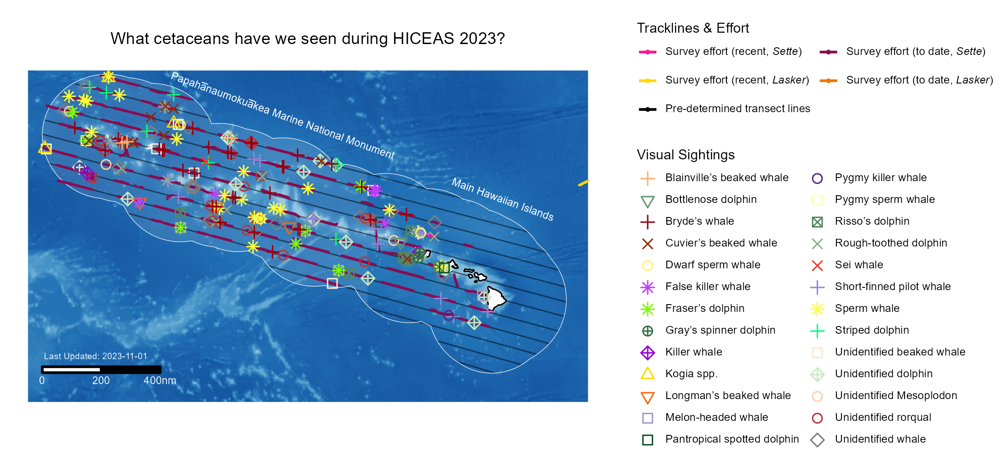
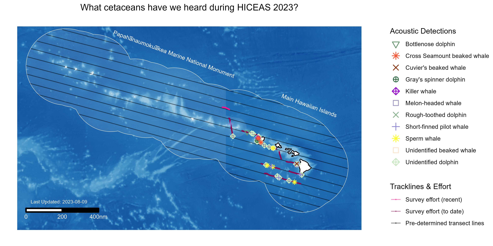

<!-- README.md is generated from README.Rmd. Please edit that file -->

```{r setup, include = FALSE}
knitr::opts_chunk$set(
  echo = FALSE, 
  warnings = FALSE, 
  error = FALSE, 
  message = FALSE,
  collapse = TRUE,
  comment = FALSE
)

link_repo <- "https://github.com/PIFSC-Protected-Species-Division/cruise-maps-live"

library(fontawesome)
```


# Near Real-Time Cetacean Cruise Maps

`r fa(name = "calendar-check")` *Last Update: `r format(Sys.Date(), "%d %b %Y")`*

`r fa(name = "person-digging")` *This code is always in development*

## Developers

**Janelle Badger** (janelle.badger AT noaa.gov; [\@badgerjj](https://github.com/badgerjj))  
**Yvonne Barkley** (yvonne.barkley AT noaa.gov; [\@ybarkley](https://github.com/ybarkley))  
**Selene Fregosi** (selene.fregosi AT noaa.gov; [\@sfregosi](https://github.com/sfregosi))   
**Kym Yano** (kym.yano AT noaa.gov; [\@kmyano](https://github.com/kmyano))  

Cetacean Research Program | Protected Species Division  
Pacific Islands Fisheries Science Center  
National Marine Fisheries Service  
National Oceanic and Atmospheric Administration

The idea for these live maps and this repository was inspired by the Alaska Fisheries Science Center's live survey maps. The code and outputs presented here are modified from the AFSC team's [survey-live-temperature-map](https://github.com/afsc-gap-products/survey-live-temperature-map) repository. 

## Table of contents

```{r toc, echo = FALSE, eval = TRUE, warning=FALSE}
toc <- strsplit(x = readtext::readtext(file = "./README.Rmd", 
                                       verbosity = 0)[[2]], split = "\n")
toc <- toc[[1]][substr(x = toc[[1]], start = 1, stop = 1) == "#"]
toc <- toc[-c(1:3)]
toc <- toc[-grep(pattern = "##### ", x = toc, fixed = TRUE)]
toc_list <- toc
# toc_list <- toc_list[-grep(pattern = "##### ", x = toc_list, fixed = TRUE)]
toc_list <- gsub(pattern = "#### ", replacement = ">      - [*", 
                 x = toc_list, fixed = TRUE)
toc_list <- gsub(pattern = "### ", replacement = ">    - [*", 
                 x = toc_list, fixed = TRUE)
toc_list <- gsub(pattern = "## ", replacement = ">  - [*", 
                 x = toc_list, fixed = TRUE)
toc_link <- tolower(gsub(pattern = " ", replacement = "-", 
                          x = gsub(pattern = "#", replacement = "", 
                                   x = gsub(pattern = "# ", replacement = "", 
                                            x = toc, fixed = TRUE), fixed = TRUE)))
toc <- paste0(toc_list, "*](#", toc_link, ")", collapse = "\n")
```

`r toc`

## Purpose

The Hawaiian Islands Cetacean and Ecosystem Survey (HICEAS) assesses whale, dolphin, and seabird populations across the Hawaiian Islands. The survey is conducted by NOAA Fisheries' Pacific Islands Fisheries Science Center. The code in this repository allows us to generate summary maps and tables of our survey progress and cetacean sightings. These scripts compile the various data streams, collected and uploaded to Google Drive by the researchers at sea, and then create daily maps and an up-to-date summary table. The generated map and table are shared to the cruise website.

- [HICEAS 2023 is Underway!](https://storymaps.arcgis.com/stories/b3bbf0e90d0141f7bf47edc5339ccb7a)

##### Latest map

(click to enlarge)

```{r latest-maps, fig.alt = c("HICEAS 2023 Map - Latest Map. This map shows the most up-to-date completed survey tracklines (pink) and cetacean sightings (colored symbols). The map creation date is above the scale bar. The U.S. Exclusive Economic Zone (EEZ) surrounding the Hawaiian archipelago (study area) is marked with a white boundary line and planned transect lines are in thin black lines. The Papahānaumokuākea Marine National Monument area and Main Hawaiian Islands are labeled in white text. The transect lines run lengthwise from northwest to southeast, covering the entire EEZ.", "HICEAS 2023 Map - Latest Map. This map shows the most up-to-date completed survey tracklines (pink) and acoustic detections of cetaceans (colored symbols). The map creation date is above the scale bar. The U.S. Exclusive Economic Zone (EEZ) surrounding the Hawaiian archipelago (study area) is marked with a white boundary line and planned transect lines are in thin black lines. The Papahānaumokuākea Marine National Monument area and Main Hawaiian Islands are labeled in white text. The transect lines run lengthwise from northwest to southeast, covering the entire EEZ."), out.width = "25%"}




```

## Notes

[How to set up automation using Windows Task Scheduler](https://docs.google.com/document/d/1eSvKQl3RGqqxyt8O07Qfya14hhlKR16bmz8MlNiHDQ8/edit) This includes information on setting up the Windows Task Scheduler to execute an R script on a schedule (in our case `run.r`) and to autocommit and push changes to GitHub. 

Where the input and output files will be saved: [Google Drive - Restricted access](https://drive.google.com/drive/u/0/folders/1okUHW9LRxXJ8T8Djxu_VUKV3LPmEMp6c)

When running the `run.R` script for the first time on your local machine, first run the `prep.R` script to ensure the folder structure is set up properly and all necessary packages are installed.

To re-run a day (perhaps the DAS was updated/corrected), use the `das_reRunPrep.R` script. This will remove previous entries for this date from the compiled data outputs and the `dasList` record of which das have been successfully processed. After cleaning those up, the full `run.R` script can be re-run and the latest copy of those DAS files will be downloaded and processed.

To re-run all days, delete the `dasList*.Rda` file from the 'outputs' folder and all the `compiled*.Rda` files from the 'data' folder (e.g., `compiledDetections_OES2303.Rda`). 

## Plot Examples

As each survey leg completes we will share some example plots and gifs here! 

### Blank, pre-survey base map

![HICEAS 2023 Base Map, A bathymetric map of the HICEAS study area and the planned transect lines. The U.S. Exclusive Economic Zone (EEZ) surrounding the Hawaiian archipelago (study area) is marked with a white boundary line and planned transect lines are in thin black lines. The Papahānaumokuākea Marine National Monument area and Main Hawaiian Islands are labeled in white text. The transect lines run lengthwise from northwest to southeast, covering the entire EEZ. This map image does not show any completed survey tracklines or cetacaen sightings but serves as the basemap that will be populated with this information as the survey gets underway.](./outputs/blank/dailyMap_blankCopy.png)

### Leg 1

##### Visual sightings
![HICEAS 2023 Map - End of Leg 1. This map shows the completed survey tracklines (pink) and cetacean sightings (colored symbols) that occured during HICEAS 2023 Leg 1 on the R/V Oscar Elton Sette from 23 to 28 July 2023. The U.S. Exclusive Economic Zone (EEZ) surrounding the Hawaiian archipelago (study area) is marked with a white boundary line and planned transect lines are in thin black lines. The Papahānaumokuākea Marine National Monument area and Main Hawaiian Islands are labeled in white text. The transect lines run lengthwise from northwest to southeast, covering the entire EEZ. ](./outputs/map_archive/OES2303_leg1/dailyMap_visuals_OES2303_leg1_ran2023-08-15.png)

##### Acoustic detections
![HICEAS 2023 Map - End of Leg 1. This map shows the completed survey tracklines (pink) and acoustic detections of cetaceans (colored symbols) that occured during HICEAS 2023 Leg 1 on the R/V Oscar Elton Sette from 23 to 28 July 2023. The U.S. Exclusive Economic Zone (EEZ) surrounding the Hawaiian archipelago (study area) is marked with a white boundary line and planned transect lines are in thin black lines. The Papahānaumokuākea Marine National Monument area and Main Hawaiian Islands are labeled in white text. The transect lines run lengthwise from northwest to southeast, covering the entire EEZ. ](./outputs/map_archive/OES2303_leg1/dailyMap_acoustics_OES2303_leg1_ran2023-08-15.png)

## Suggestions and Comments

If you see that the data, product, or metadata can be improved, you are invited to create a 
[pull request](https://github.com/PIFSC-Protected-Species-Division/cruise-maps-live/pulls), or
[submit an issue to this repository](https://github.com/PIFSC-Protected-Species-Division/cruise-maps-live/issues)

If you notice the map has not been updated in a few days, please [submit an issue](https://github.com/PIFSC-Protected-Species-Division/cruise-maps-live/issues). Sometimes that can happen if our processing computer reboots or there is an authentication issue. We will see the issue and check it out!

## R Version Metadata

```{r ver}
sessionInfo()
```

## NOAA Disclaimer and License

<sub>This repository is a scientific product and is not official communication of the National Oceanic and Atmospheric Administration, or the United States Department of Commerce. All NOAA GitHub project code is provided on an ‘as is’ basis and the user assumes responsibility for its use. Any claims against the Department of Commerce or Department of Commerce bureaus stemming from the use of this GitHub project will be governed by all applicable Federal law. Any reference to specific commercial products, processes, or services by service mark, trademark, manufacturer, or otherwise, does not constitute or imply their endorsement, recommendation or favoring by the Department of Commerce. The Department of Commerce seal and logo, or the seal and logo of a DOC bureau, shall not be used in any manner to imply endorsement of any commercial product or activity by DOC or the United States Government.


<sub>Software code created by U.S. Government employees is not subject to copyright in the United States (17 U.S.C. §105). The United States/Department of Commerce reserve all rights to seek and obtain copyright protection in countries other than the United States for Software authored in its entirety by the Department of Commerce. To this end, the Department of Commerce hereby grants to Recipient a royalty-free, nonexclusive license to use, copy, and create derivative works of the Software outside of the United States.


[U.S. Department of Commerce](https://www.commerce.gov/) | [National
Oceanographic and Atmospheric Administration](https://www.noaa.gov) |
[NOAA Fisheries](https://www.fisheries.noaa.gov/)
